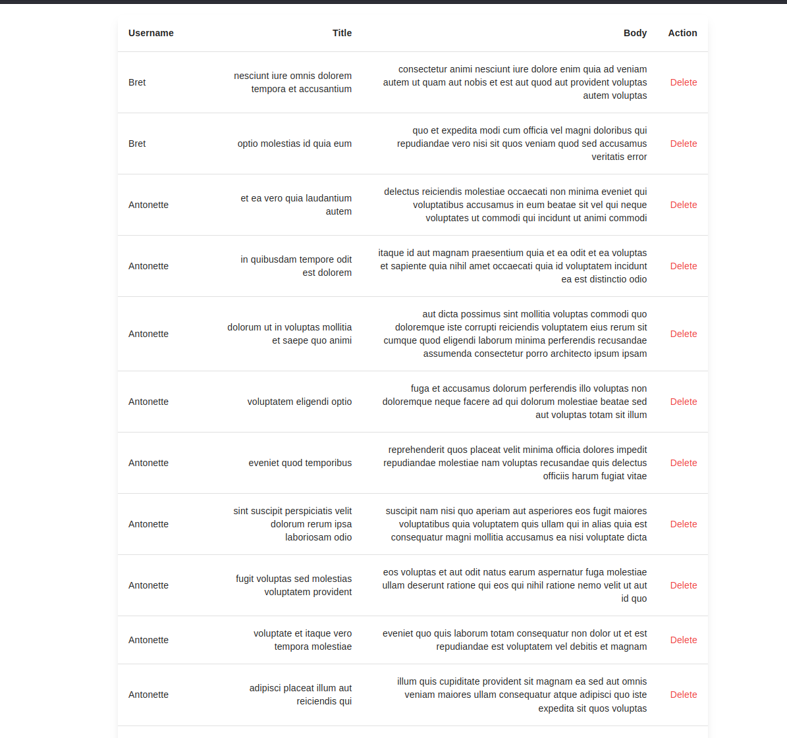

## SLIM TASK


# SETTING UP LOCAL ENVIRONMENT

## Requirements:
- PHP 8.3+ (Simplexml extension)
- MariaDB 15.1
- React 18.3
## Setup
- Run the commands in terminal to start the server:
```
cd public/
php -S localhost:8888
```
- REST API URL: http://localhost:8888
- Notice: Please configure your database settings in _index.php_ and _data-seeder.php_ files before run the script.
```
'host'     => 'your-host',
'dbname'   => 'slim-task',
'username' => 'your-username',
'password' => 'your-password',
```
- Run the command below. This will create a database and tables, and import data.
```
php data-seeder.php
```
- Run the commands below on the project root directory to start React app.
```
cd frontend && npm i && npm run start
```
- Frontend application URL: http://localhost:3000 
- Ready to go!
